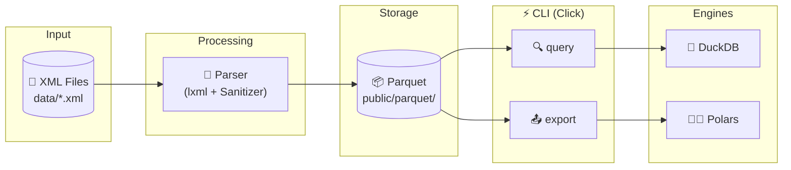

# Open Data Chunker

[](https://www.python.org/downloads/)
[](https://www.docker.com/)
[](https://opensource.org/licenses/MIT)

A high-performance ETL pipeline for processing large-scale XML datasets from the Italian RNA (Registro Nazionale degli Aiuti) Open Data. Transforms XML files into optimized, year-partitioned Parquet format with built-in query and export capabilities.

## ✨ Features

- **🚀 High-Performance Parsing** — Multi-worker parallel processing with streaming XML parser
- **🛡️ Fault-Tolerant** — Automatic recovery from malformed XML with invalid character sanitization
- **📦 Parquet Output** — Columnar storage with Hive-style partitioning (`ANNO=YYYY`)
- **🔍 SQL Queries** — Interactive DuckDB-powered queries on processed datasets
- **📤 Flexible Export** — CSV/TXT export with configurable delimiters
- **🐳 Dockerized** — Fully containerized for reproducible environments

## 🏗️ Architecture



### Data Model

The pipeline extracts three normalized tables from the XML:

| Table | Description |
|-------|-------------|
| `aiuti` | Main grants/subsidies records |
| `componenti` | Aid component details (linked to `aiuti`) |
| `strumenti` | Financial instruments (linked to `componenti`) |

## 🚀 Quick Start

### Prerequisites

- Docker Engine ≥ 20.10
- Docker Compose ≥ 2.0

### Installation

```bash
# Clone the repository
git clone https://github.com/yourusername/Open-Data-Chunker.git
cd Open-Data-Chunker

# Build the Docker image
docker compose build
```

### Basic Usage

```bash
# Parse a single XML file
docker compose run --rm etl python -m src.cli parse --input data/2022/OpenData_Aiuti_2022_08.xml

# Parse entire data directory with 8 parallel workers
docker compose run --rm etl python -m src.cli parse --input data/ --workers 8
```

Output is written to `public/parquet/{table}/ANNO=YYYY/`.

## 📖 CLI Reference

### `parse` — Process XML Files

```bash
docker compose run --rm etl python -m src.cli parse [OPTIONS]
```

| Option | Description | Default |
|--------|-------------|---------|
| `-i, --input` | Input file or directory (required) | — |
| `-o, --output` | Output directory for Parquet | `public/parquet` |
| `-w, --workers` | Number of parallel workers | `4` |

**Example:**
```bash
docker compose run --rm etl python -m src.cli parse \
  --input data/ \
  --output public/parquet \
  --workers 8
```

---

### `query` — Run SQL Queries

```bash
docker compose run --rm etl python -m src.cli query [OPTIONS]
```

| Option | Description | Default |
|--------|-------------|---------|
| `-t, --table` | Table to query (`aiuti`, `componenti`, `strumenti`) | required |
| `-q, --query` | Custom SQL query (DuckDB syntax) | — |
| `-l, --limit` | Limit results | `10` |

**Examples:**
```bash
# View first 5 records from aiuti
docker compose run --rm etl python -m src.cli query --table aiuti --limit 5

# Custom aggregation query
docker compose run --rm etl python -m src.cli query \
  --table strumenti \
  --query "SELECT ANNO, SUM(ELEMENTO_DI_AIUTO) as total FROM read_parquet('public/parquet/strumenti/**/*.parquet') GROUP BY ANNO ORDER BY ANNO"
```

---

### `export` — Export to CSV/TXT

```bash
docker compose run --rm etl python -m src.cli export [OPTIONS]
```

| Option | Description | Default |
|--------|-------------|---------|
| `-t, --table` | Table to export | required |
| `-f, --format` | Output format (`csv`, `txt`) | `csv` |
| `-o, --output` | Output file path | required |
| `-d, --delimiter` | Field delimiter | `,` |

**Examples:**
```bash
# Export to CSV
docker compose run --rm etl python -m src.cli export \
  --table aiuti \
  --format csv \
  --output public/exports/aiuti.csv

# Export with pipe delimiter
docker compose run --rm etl python -m src.cli export \
  --table strumenti \
  --format txt \
  --delimiter "|" \
  --output public/exports/strumenti.txt
```

## 📁 Project Structure

```
Open-Data-Chunker/
├── src/
│   ├── __init__.py
│   ├── cli.py          # Click CLI entry point
│   ├── parser.py       # XML parsing with CleanFileInputStream
│   ├── exporter.py     # Query execution & export logic
│   └── models.py       # PyArrow schema definitions
├── data/               # Input XML files (gitignored)
├── public/
│   ├── parquet/        # Output Parquet datasets
│   └── exports/        # Exported CSV/TXT files
├── tests/
├── docs/
│   └── usage.md
├── Dockerfile
├── docker-compose.yml
├── pyproject.toml
└── requirements.txt
```

## 🛠️ Development

### Local Setup (without Docker)

```bash
# Create virtual environment
python -m venv .venv
source .venv/bin/activate

# Install dependencies
pip install -r requirements.txt

# Run CLI directly
python -m src.cli parse --input data/ --workers 4
```

### Running Tests

```bash
docker compose run --rm etl pytest tests/
```

## ⚙️ Configuration

### Environment Variables

| Variable | Description | Default |
|----------|-------------|---------|
| `PYTHONUNBUFFERED` | Force unbuffered stdout/stderr | `1` (set in Docker) |

### Parser Tuning

Adjustable constants in `src/parser.py`:

```python
BATCH_SIZE = 10000  # Records per Parquet file write
```

## 🔧 Technical Details

### XML Sanitization

The `CleanFileInputStream` wrapper automatically removes invalid XML characters:
- Control characters `0x00-0x08`, `0x0B`, `0x0C`, `0x0E-0x1F`
- Malformed numeric entities (`&#0;` through `&#31;`, except `&#9;`, `&#10;`, `&#13;`)

### Memory Management

Uses `lxml.etree.iterparse()` with aggressive element cleanup:
```python
elem.clear()
while elem.getprevious() is not None:
    del elem.getparent()[0]
```

### Parallel Processing

Worker processes use `ProcessPoolExecutor` with configurable `--workers` option:
- CPU-bound: Scales linearly with available cores
- I/O-bound: Benefits from moderate parallelism

## 📊 Performance

Tested on a dataset of ~165 XML files:

| Metric | Value |
|--------|-------|
| Parse Speed | ~50k records/sec (8 workers) |
| Memory Usage | ~200MB per worker |
| Output Compression | ~10x vs raw XML |

## 🤝 Contributing

1. Fork the repository
2. Create a feature branch (`git checkout -b feature/amazing-feature`)
3. Commit your changes (`git commit -m 'Add amazing feature'`)
4. Push to the branch (`git push origin feature/amazing-feature`)
5. Open a Pull Request

## 📄 License

Distributed under the MIT License. See `LICENSE` for more information.

## 🙏 Acknowledgments

- [RNA Open Data](https://www.rna.gov.it/) — Italian State Aid Registry
- [lxml](https://lxml.de/) — High-performance XML processing
- [Polars](https://www.pola.rs/) — Lightning-fast DataFrames
- [DuckDB](https://duckdb.org/) — In-process analytical database
