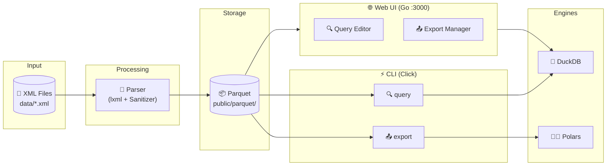

# Open Data Chunker


[](https://www.python.org/downloads/)
[](https://go.dev/)
[](https://www.docker.com/)
[](https://pola.rs/)
[](https://duckdb.org/)
[](https://parquet.apache.org/)
[](https://getfedora.org/)
[](https://opensource.org/licenses/MIT)

A high-performance ETL pipeline for processing large-scale XML datasets from the Italian RNA (Registro Nazionale degli Aiuti) Open Data. Transforms XML files into optimized, year-partitioned Parquet format with built-in query and export capabilities.

## ✨ Features

- **🚀 High-Performance Parsing** — Multi-worker parallel processing with streaming XML parser
- **🛡️ Fault-Tolerant** — Automatic recovery from malformed XML with invalid character sanitization
- **📦 Parquet Output** — Columnar storage with Hive-style partitioning (`ANNO=YYYY`)
- **🔍 SQL Queries** — Interactive DuckDB-powered queries on processed datasets
- **📤 Flexible Export** — CSV/TXT export with configurable delimiters
- **🌐 Web UI** — Browser-based query editor and export manager (Go + DuckDB, porta `3000`)
- **🐳 Dockerized** — Fully containerized for reproducible environments

## 🏗️ Architecture


```mermaid
flowchart LR
    subgraph Input
        XML[("📄 XML Files<br/>data/*.xml")]
    end

    subgraph Processing
        Parser["🔧 Parser<br/>(lxml + Sanitizer)"]
    end

    subgraph Storage
        Parquet[("📦 Parquet<br/>public/parquet/")]
    end

    subgraph CLI["⚡ CLI (Click)"]
        Query["🔍 query"]
        Export["📤 export"]
    end

    subgraph Web["🌐 Web UI (Go :3000)"]
        WebQuery["🔍 Query Editor"]
        WebExport["📤 Export Manager"]
    end

    subgraph Engines
        DuckDB["🦆 DuckDB"]
        Polars["🐻‍❄️ Polars"]
    end

    XML --> Parser --> Parquet
    Parquet --> Query --> DuckDB
    Parquet --> Export --> Polars
    Parquet --> Web --> DuckDB
```

### Data Model

The pipeline extracts three normalized tables from the XML:

| Table | Description |
|-------|-------------|
| `aiuti` | Main grants/subsidies records |
| `componenti` | Aid component details (linked to `aiuti`) |
| `strumenti` | Financial instruments (linked to `componenti`) |

## 🚀 Quick Start

### Prerequisites

- Docker Engine ≥ 20.10
- Docker Compose ≥ 2.0

### Installation

```bash
# Clone the repository
git clone https://github.com/yourusername/Open-Data-Chunker.git
cd Open-Data-Chunker

# Build all services (ETL pipeline + Web UI)
docker compose build
```

### Basic Usage

```bash
# Parse a single XML file
docker compose run --rm etl python -m src.cli parse --input data/2022/OpenData_Aiuti_2022_08.xml

# Parse entire data directory with 8 parallel workers
docker compose run --rm etl python -m src.cli parse --input data/ --workers 8

# Start the Web UI
docker compose up web
# → Open http://localhost:3000
```

Output is written to `public/parquet/{table}/ANNO=YYYY/`.

## 📖 CLI Reference

### `parse` — Process XML Files

```bash
docker compose run --rm etl python -m src.cli parse [OPTIONS]
```

| Option | Description | Default |
|--------|-------------|---------|
| `-i, --input` | Input file or directory (required) | — |
| `-o, --output` | Output directory for Parquet | `public/parquet` |
| `-w, --workers` | Number of parallel workers | `4` |

**Example:**
```bash
docker compose run --rm etl python -m src.cli parse \
  --input data/ \
  --output public/parquet \
  --workers 8
```

---

### `query` — Run SQL Queries

```bash
docker compose run --rm etl python -m src.cli query [OPTIONS]
```

| Option | Description | Default |
|--------|-------------|---------|
| `-t, --table` | Table to query (`aiuti`, `componenti`, `strumenti`) | required |
| `-q, --query` | Custom SQL query (DuckDB syntax) | — |
| `-l, --limit` | Limit results | `10` |

**Examples:**
```bash
# View first 5 records from aiuti
docker compose run --rm etl python -m src.cli query --table aiuti --limit 5

# Custom aggregation query
docker compose run --rm etl python -m src.cli query \
  --table strumenti \
  --query "SELECT ANNO, SUM(ELEMENTO_DI_AIUTO) as total FROM read_parquet('public/parquet/strumenti/**/*.parquet') GROUP BY ANNO ORDER BY ANNO"
```

---

### `export` — Export to CSV/TXT

```bash
docker compose run --rm etl python -m src.cli export [OPTIONS]
```

| Option | Description | Default |
|--------|-------------|---------|
| `-t, --table` | Table to export | required |
| `-f, --format` | Output format (`csv`, `txt`) | `csv` |
| `-o, --output` | Output file path | required |
| `-d, --delimiter` | Field delimiter | `,` |

**Examples:**
```bash
# Export to CSV
docker compose run --rm etl python -m src.cli export \
  --table aiuti \
  --format csv \
  --output public/exports/aiuti.csv


# Export with pipe delimiter
docker compose run --rm etl python -m src.cli export \
  --table strumenti \
  --format txt \
  --delimiter "|" \
  --output public/exports/strumenti.txt
```

### `export-aggregated` — Export Aggregated Year-by-Year Data

Generates a specialized CSV export where each row corresponds to a single Aid ("Aiuto") with aggregated metrics from its Components and Instruments.
**Features**:
- Automatically handles join between Aiuti, Componenti, and Strumenti
- Calculates total `IMPORTO_NOMINALE` and `ELEMENTO_DI_AIUTO` per Aid
- Counts components and instruments
- Concatenates multiple ATECO codes (`|` separated)
- **Processes one year at a time** to optimize memory usage
- Outputs one CSV file per year (e.g., `export_2024.csv`, `export_2023.csv`)

```bash
docker compose run --rm etl python -m src.cli export-aggregated [OPTIONS]
```

| Option | Description | Default |
|--------|-------------|---------|
| `-o, --output` | Output file path (used as prefix) | required |
| `-d, --delimiter` | Field delimiter | `,` |

**Example:**
```bash
docker compose run --rm etl python -m src.cli export-aggregated --output public/exports/aggregated.csv
```
This will generate `public/exports/aggregated_2024.csv`, `public/exports/aggregated_2023.csv`, etc.

---

## 🌐 Web UI — Query & Export Interface

A lightweight browser-based interface for running SQL queries, previewing results, and managing CSV exports. Built with Go + DuckDB (in-process) and a vanilla HTML/CSS/JS frontend.

### Quick Start

```bash
# Build and start the web service
docker compose build web
docker compose up web

# → Open http://localhost:3000
```

### Pages

#### Query Editor (`/`)
- SQL editor with line numbers and **Ctrl+Enter** shortcut
- Schema inspector (columns + types for all three tables)
- Pre-built query templates:
  - Record count per year
  - Top 20 beneficiaries by total amount
  - Distribution by region
  - Yearly totals (importo + elemento di aiuto)
  - **Search companies by tax code / P.IVA** (IN list — edit before running)
- Results table (preview capped at **1 000 rows**)
- Three export options:
  - **Esporta CSV** — saves to `public/exports/` via DuckDB `COPY TO`, then triggers download
  - **Download CSV completo** — streams the full query result directly (no row limit)

#### Export & Download (`/`)
| Export type | Output directory | Description |
|---|---|---|
| **Aggregato** | `public/exports/` | Aiuti + Componenti + Strumenti aggregated (all records) |
| **Aggregato CUP** | `public/exports/` | Same, filtered to records with a valid CUP |
| **Classificato AI/Non-AI** | `public/classified/` | Aggregated + classification join from cache |

Each generates one CSV per year with a real-time progress bar. Files appear in the **File disponibili** list as soon as each year completes and can be downloaded immediately.

> **Note:** The classified export requires a pre-built classification cache at `public/cache/classification_cache.parquet`.
> Build it with: `docker compose run --rm etl python -m src.cli build-cache --output public/cache/classification_cache.parquet`

### REST API

| Method | Path | Description |
|--------|------|-------------|
| `GET` | `/api/tables` | Available tables with row counts and year partitions |
| `GET` | `/api/schema/{table}` | Column names and types |
| `GET` | `/api/templates` | Pre-built SQL query templates |
| `POST` | `/api/query` | Execute SQL (preview, max 1 000 rows). Body: `{"sql":"...","limit":1000}` |
| `POST` | `/api/export/csv` | Save query result to `public/exports/` and return download URL |
| `POST` | `/api/export/csv/stream` | Stream full query result as CSV response (no row limit) |
| `GET` | `/api/exports` | List all CSV files in exports + classified directories |
| `GET` | `/api/exports/download?file=&cat=` | Download a specific file |
| `POST` | `/api/export/generate` | Start async export job. Body: `{"type":"aggregated|aggregated_cup|classified"}` |
| `GET` | `/api/export/status/{id}` | Poll job progress |

### Environment Variables (web service)

| Variable | Description | Default |
|----------|-------------|---------|
| `DATA_DIR` | Path to Parquet datasets | `/app/public/parquet` |
| `EXPORTS_DIR` | Path to CSV exports | `/app/public/exports` |
| `CLASSIFIED_DIR` | Path to classified CSVs | `/app/public/classified` |
| `CACHE_DIR` | Path to classification cache | `/app/public/cache` |
| `PORT` | HTTP listen port | `3000` |

---

### `classify` — AI/Non-AI Classification


Classifies project descriptions using the `inference-service`.

**Prerequisites:**
1. Ensure the `etl` image is built: `docker compose build etl`
2. Start the inference service (defaults to PyTorch backend): `docker compose up inference-service`

```bash
docker compose run --rm etl python -m src.cli classify [OPTIONS]
```

| Option | Description | Default |
|--------|-------------|---------|
| `-o, --output` | Output directory for classified CSVs | required |
| `-y, --year` | Specific year to process (optional) | — |
| `-b, --batch-size` | Batch size for inference | `32` |

**Examples:**
```bash
# Docker: classify all years
docker compose run --rm etl python -m src.cli classify --output public/classified

# Local: classify specific year
python -m src.cli classify --output public/classified --year 2024
```

---

### `clean-text` — Clean Text Fields

Removes commas and newlines from all text fields in Parquet files, preventing CSV export issues.

```bash
# Docker
docker compose run --rm etl python -m src.cli clean-text

# Local
python -m src.cli clean-text
```

---

### `count-descriptions` — Count Description Occurrences

Groups and counts project descriptions to identify duplicates.

```bash
docker compose run --rm etl python -m src.cli count-descriptions [OPTIONS]
```

| Option | Description | Default |
|--------|-------------|---------|
| `-o, --output` | Output CSV file path | — (prints to stdout) |
| `-l, --limit` | Limit results | — (all) |

**Examples:**
```bash
# Docker: view top 20 most common descriptions
docker compose run --rm etl python -m src.cli count-descriptions --limit 20

# Local: save all counts to CSV
python -m src.cli count-descriptions --output public/exports/description_counts.csv
```

---

### `build-cache` — Build Classification Cache

Extracts unique descriptions via DuckDB, classifies each one **a single time** through the inference-service, and saves the result as a Parquet cache file. This dramatically speeds up classification when descriptions repeat across many records.

**Prerequisites:** The `inference-service` must be running.

```bash
docker compose run --rm etl python -m src.cli build-cache [OPTIONS]
```

| Option | Description | Default |
|--------|-------------|---------|
| `-o, --output` | Output Parquet cache file path | required |
| `-b, --batch-size` | Batch size for inference | `32` |
| `--inference-url` | Inference service URL | `http://inference-service:8080/classify` |

**Examples:**
```bash
# Docker
docker compose run --rm etl python -m src.cli build-cache \
  --output public/cache/classification_cache.parquet \
  --batch-size 64

# Local (inference-service on localhost)
python -m src.cli build-cache \
  --output public/cache/classification_cache.parquet \
  --inference-url http://localhost:8080/classify
```

---

### `classify-cached` — Classify Using Pre-Built Cache

Uses the pre-built classification cache to assign labels via a fast **left join** per year. Each year is processed in parallel using multithreading.

```bash
docker compose run --rm etl python -m src.cli classify-cached [OPTIONS]
```

| Option | Description | Default |
|--------|-------------|---------|
| `-o, --output` | Output directory for classified CSVs | required |
| `-c, --cache` | Path to classification cache Parquet file | required |
| `-y, --year` | Specific year to process (optional) | — (all) |
| `-w, --workers` | Number of threads for parallel join+export | `4` |

**Examples:**
```bash
# Docker: classify all years using cache
docker compose run --rm etl python -m src.cli classify-cached \
  --output public/classified \
  --cache public/cache/classification_cache.parquet \
  --workers 4

# Local: classify single year
python -m src.cli classify-cached \
  --output public/classified \
  --cache public/cache/classification_cache.parquet \
  --year 2024
```

> **💡 Recommended pipeline:** Run `clean-text` → `build-cache` → `classify-cached` for optimal performance.
> If there are 2M records but only 50K unique descriptions, this achieves a ~40x speedup over `classify`.

## 📁 Project Structure

```
Open-Data-Chunker/
├── src/
│   ├── __init__.py
│   ├── cli.py                    # Click CLI entry point
│   ├── parser.py                 # XML parsing with CleanFileInputStream
│   ├── exporter.py               # Query execution & export logic
│   ├── classifier.py             # AI/Non-AI classification (per-row)
│   ├── classification_cache.py   # Cached classification (unique descriptions)
│   └── models.py                 # PyArrow schema definitions
├── web/                          # 🌐 Web UI service (Go)
│   ├── main.go                   # HTTP server + REST API (DuckDB in-process)
│   ├── go.mod / go.sum           # Go module dependencies
│   ├── Dockerfile                # Multi-stage build (golang:1.24 → debian-slim)
│   └── static/
│       ├── index.html            # SPA layout (sidebar + 2 pages)
│       ├── style.css             # Dark theme design system
│       └── app.js                # Frontend logic
├── data/               # Input XML files (gitignored)
├── public/
│   ├── parquet/        # Output Parquet datasets
│   ├── cache/          # Classification cache
│   ├── classified/     # Classified CSV exports
│   └── exports/        # Exported CSV/TXT files
├── tests/
├── docs/
│   └── usage.md
├── Dockerfile          # ETL pipeline image
├── docker-compose.yml  # ETL + Web UI + Inference service
├── pyproject.toml
└── requirements.txt
```

## 🛠️ Development

### Local Setup (without Docker)

```bash
# Create virtual environment
python -m venv .venv
source .venv/bin/activate

# Install dependencies
pip install -r requirements.txt

# Run CLI directly
python -m src.cli parse --input data/ --workers 4
```

### Running Tests

```bash
docker compose run --rm etl pytest tests/
```

## ⚙️ Configuration

### Environment Variables

| Variable | Description | Default |
|----------|-------------|---------|
| `PYTHONUNBUFFERED` | Force unbuffered stdout/stderr | `1` (set in Docker) |

### Parser Tuning

Adjustable constants in `src/parser.py`:

```python
BATCH_SIZE = 10000  # Records per Parquet file write
```

## 🔧 Technical Details

### XML Sanitization

The `CleanFileInputStream` wrapper automatically removes invalid XML characters:
- Control characters `0x00-0x08`, `0x0B`, `0x0C`, `0x0E-0x1F`
- Malformed numeric entities (`&#0;` through `&#31;`, except `&#9;`, `&#10;`, `&#13;`)

### Memory Management

Uses `lxml.etree.iterparse()` with aggressive element cleanup:
```python
elem.clear()
while elem.getprevious() is not None:
    del elem.getparent()[0]
```

### Parallel Processing

Worker processes use `ProcessPoolExecutor` with configurable `--workers` option:
- CPU-bound: Scales linearly with available cores
- I/O-bound: Benefits from moderate parallelism

## 📊 Performance

Tested on a dataset of ~165 XML files:

| Metric | Value |
|--------|-------|
| Parse Speed | ~50k records/sec (8 workers) |
| Memory Usage | ~200MB per worker |
| Output Compression | ~10x vs raw XML |

## 🤝 Contributing

1. Fork the repository
2. Create a feature branch (`git checkout -b feature/amazing-feature`)
3. Commit your changes (`git commit -m 'Add amazing feature'`)
4. Push to the branch (`git push origin feature/amazing-feature`)
5. Open a Pull Request

## 📄 License

Distributed under the MIT License. See `LICENSE` for more information.

## 🙏 Acknowledgments

- [RNA Open Data](https://www.rna.gov.it/) — Italian State Aid Registry
- [lxml](https://lxml.de/) — High-performance XML processing
- [Polars](https://www.pola.rs/) — Lightning-fast DataFrames
- [DuckDB](https://duckdb.org/) — In-process analytical database
